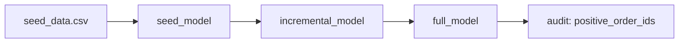

# SQLMesh + Microsoft Fabric Demo

A demonstration project showcasing how to use [SQLMesh](https://sqlmesh.com/) with Microsoft Fabric for building production-ready data transformation pipelines.

## Overview

This project demonstrates:
- Building incremental and full-refresh data models with SQLMesh
- Integration with Microsoft Fabric Warehouse as the execution engine
- Automated testing and data quality audits
- CI/CD-ready data pipeline deployment

## Project Structure

```
sqlmesh_fabric_demo/
├── models/                 # SQLMesh model definitions
│   ├── seed_model.sql     # Base model from seed data
│   ├── incremental_model.sql  # Time-based incremental model
│   └── full_model.sql     # Full refresh aggregation
├── seeds/                 # Static CSV data
├── audits/                # Data quality checks
├── tests/                 # Unit tests for models
├── notebooks/             # Jupyter notebooks (import these to Fabric)
└── config.yaml           # SQLMesh configuration
```

## Data Pipeline

The demo implements a simple e-commerce analytics pipeline:



- **seed_model**: Loads static reference data
- **incremental_model**: Processes events incrementally by date range
- **full_model**: Aggregates order counts by item with data quality audits

## Getting Started

### Prerequisites

- Python 3.11
- Microsoft Fabric workspace
- Azure Service Principal with Fabric access
- SQL Database for SQLMesh state management

### Installation

1. Clone the repository:
```bash
git clone https://github.com/mattiasthalen/sqlmesh-fabric-demo.git
cd sqlmesh_fabric_demo
```

2. Install dependencies:
```bash
# Using uv (recommended)
uv sync

# Or using pip
pip install "sqlmesh[fabric,mssql,lsp]"
```

3. Set environment variables:
```bash
export CREDENTIALS__AZURE_TENANT_ID="your_azure_tenant_id"
export CREDENTIALS__AZURE_CLIENT_ID="your_azure_client_id"
export CREDENTIALS__AZURE_CLIENT_SECRET="your_azure_client_secret"
export FABRIC__WORKSPACE_ID="your_fabric_workspace_id"
export FABRIC__SQL_ENDPOINT_ID="your_fabric_sql_endpoint_uuid"
export FABRIC__WAREHOUSE_ENDPOINT="${FABRIC__SQL_ENDPOINT_ID}.datawarehouse.fabric.microsoft.com"
export FABRIC__STATE_ENDPOINT="${FABRIC__SQL_ENDPOINT_ID}.database.fabric.microsoft.com"
export FABRIC__STATE_DATABASE="your_state_database"
```

### Running SQLMesh Locally

```bash
# Validate configuration and models
uv run sqlmesh validate

# Run tests
uv run sqlmesh test

# Preview changes for development
uv run sqlmesh plan dev

# Deploy to production
uv run sqlmesh plan prod --auto-apply

# Launch interactive UI
uv run sqlmesh ui
```

## Running in Microsoft Fabric

### Import and Configure the Notebook

1. **Import the notebook** into your Fabric workspace:
   - Navigate to your Fabric workspace
   - Import `notebooks/sqlmesh__runner.ipynb`
   - The notebook will be created in your workspace

2. **Add the codebase Lakehouse** as a resource:
   - Open the imported notebook
   - Add your codebase Lakehouse as a default lakehouse resource
   - This provides storage for the cloned repository

3. **Configure Azure Key Vault** with these secrets:
   - `CREDENTIALS--AZURE-TENANT-ID`
   - `CREDENTIALS--AZURE-CLIENT-ID`
   - `CREDENTIALS--AZURE-CLIENT-SECRET`
   - `FABRIC--WORKSPACE-ID`
   - `FABRIC--WAREHOUSE-ENDPOINT`
   - `FABRIC--STATE-ENDPOINT`
   - `FABRIC--STATE-DATABASE`
   - `GIT-PAT` (Personal Access Token for Azure DevOps)

4. **Update the notebook** with your configuration:
   - Azure Key Vault URL
   - Azure DevOps organization name
   - Azure DevOps project name
   - Repository name

5. **Run the notebook** to execute SQLMesh plans in Fabric

The notebook automates:
- Secret retrieval from Azure Key Vault
- Git repository cloning from Azure DevOps
- SQLMesh installation and execution
- Automatic plan application to production

## Testing

The project includes:
- **Unit tests** for model logic (`tests/test_full_model.yaml`)
- **Data audits** that run after model execution (`audits/assert_positive_order_ids.sql`)

Run all tests:
```bash
uv run sqlmesh test
uv run sqlmesh audit
```

## Configuration

### Model Configuration
Models are configured with:
- **Kind**: `FULL` or `INCREMENTAL_BY_TIME_RANGE`
- **Grain**: Unique key columns
- **Cron**: Schedule (default: `@daily`)
- **Audits**: Post-execution quality checks

Example from `models/incremental_model.sql`:
```sql
MODEL (
  name sqlmesh_example.incremental_model,
  kind INCREMENTAL_BY_TIME_RANGE (
    time_column event_date
  ),
  start '2020-01-01',
  cron '@daily',
  grain (id, event_date)
);
```

### Connection Configuration
Edit `config.yaml` to configure:
- Fabric Warehouse connection
- State database connection
- Model defaults
- Linting rules

## Deployment Options

### Local Development
```bash
# Run with local changes
uv run sqlmesh plan dev

# Test before deployment
uv run sqlmesh test
```

### Fabric Notebook Deployment
Import and run `notebooks/sqlmesh__runner.ipynb` in your Fabric workspace for automated execution.

### CI/CD Pipeline
```bash
# In your pipeline
uv run sqlmesh plan prod --auto-apply --no-prompts
```

## Security Setup

### Required Permissions
1. **Azure Service Principal** with:
   - `Item.ReadWrite.All` Fabric API scope
   - Contributor role on Fabric workspace
   - `db_owner` on state database

2. **Fabric Resources**:
   - Workspace with contributor access
   - Warehouse named `demo`
   - SQL Database for state management

See [Microsoft's Service Principal documentation](https://learn.microsoft.com/en-us/fabric/data-warehouse/service-principals) for detailed setup.

## Resources

- [SQLMesh Documentation](https://sqlmesh.readthedocs.io/)
- [Microsoft Fabric Documentation](https://learn.microsoft.com/en-us/fabric/)
- [SQLMesh Fabric Integration](https://sqlmesh.readthedocs.io/en/stable/integrations/engines/fabric/)

## Contributing

1. Create a feature branch
2. Make your changes
3. Run tests: `sqlmesh test`
4. Validate: `sqlmesh validate`
5. Submit a pull request

## License

This is a demo project for educational purposes.